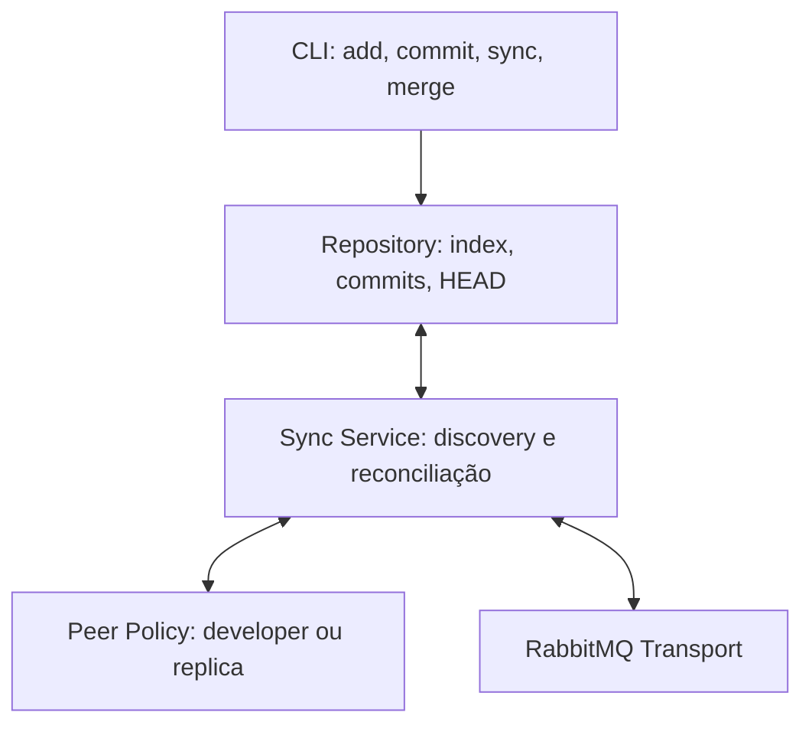
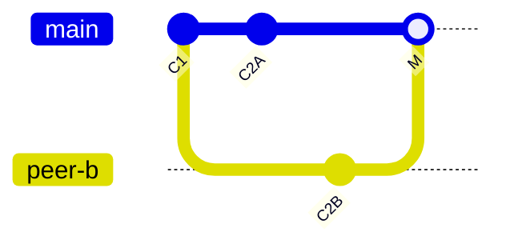
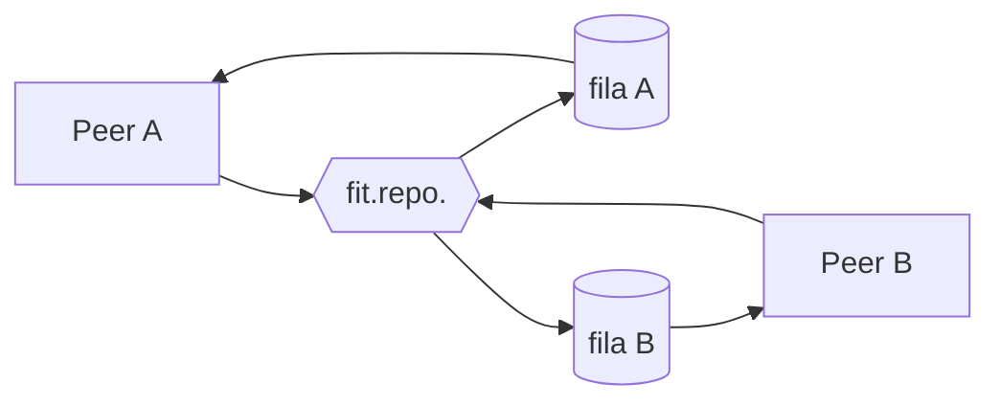
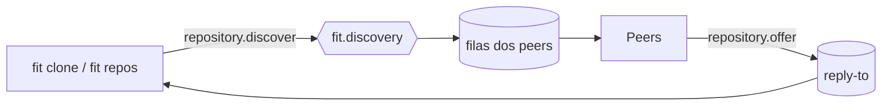
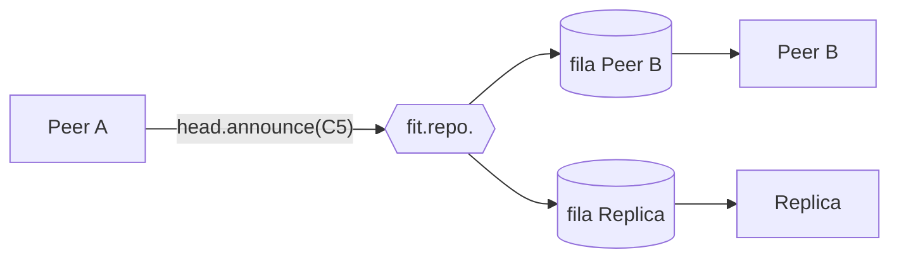
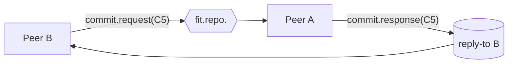
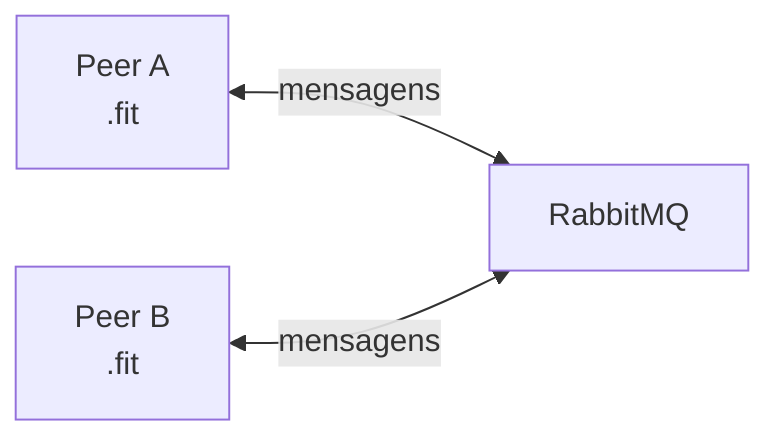
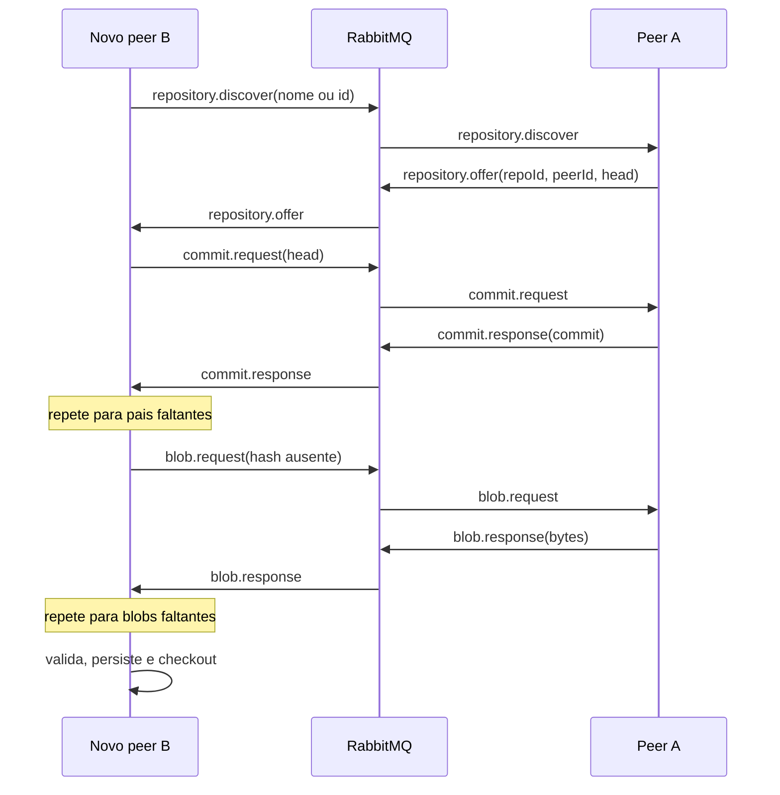
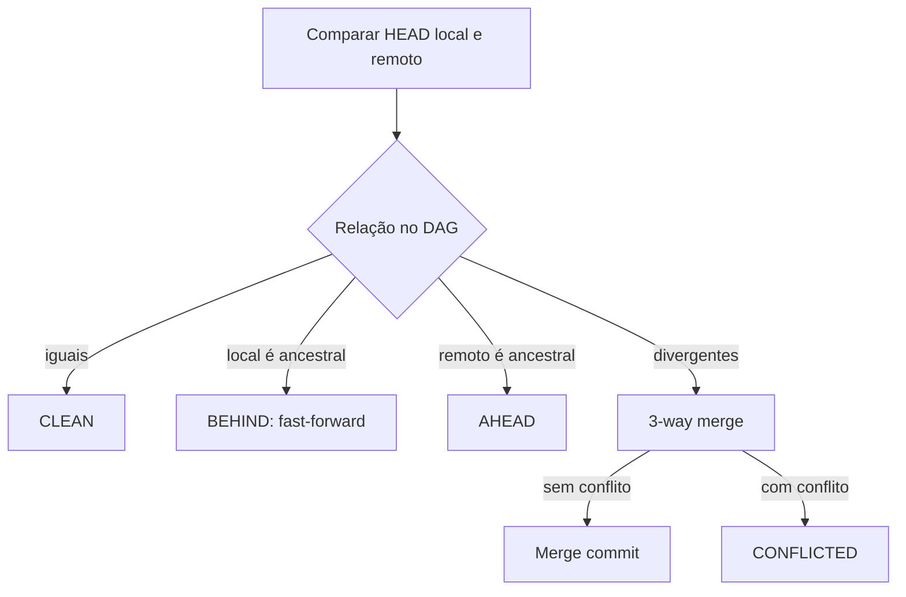
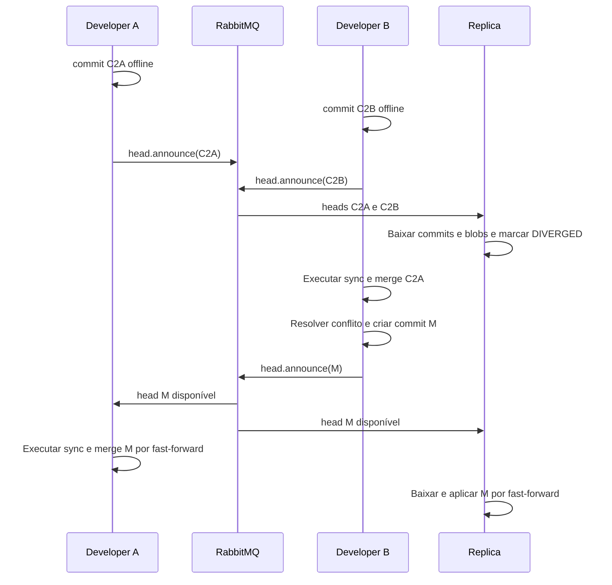

# FIT

FIT é um sistema local de controle de versão distribuído.

Ao final dessa especificação, encontra-se um glossário para os termos-chave.

Para controlar as expectativas, vamos considerar que essa especificação se aplica para uma primeira versão do projeto, chamada ao longo desse documento de v1.

As definições a seguir fazem comparação de conceitos entre Git e FIT, como blobs, commits, etc.

## Objetivo

- commits e histórico em DAG (vide [`## Modelo de histórico`](#modelo-de-histórico));
- replicação entre peers;
- trabalho offline;
- consistência eventual;
- divergência, merge e conflitos;
- tolerância a falhas de peers e do transporte.

O ambiente da v1 assume uma máquina, uma instância RabbitMQ, vários processos FIT e diretórios independentes.

## Conceitos

### Peer

Um peer é um diretório de trabalho que contém um diretório `.fit` e um processo FIT associado.

A presença de `.fit` identifica o peer.

Cada peer possui:

- `peerId` próprio e persistente;
- o mesmo `repositoryId` dos demais peers daquele repositório;
- armazenamento local de commits;
- `HEAD` próprio;
- working tree independente.

Ao reiniciar, o peer mantém sua identidade e recupera seu estado a partir de `.fit`.


Ou seja, o estado autoritativo vive nos peers. RabbitMQ transporta anúncios, pedidos e respostas, mas não é o banco de dados do repositório.

### Repositório

`fit init <nome>` cria o primeiro peer e um novo repositório:

- `repositoryId`: UUID, identidade real do repositório;
- `repositoryName`: nome humano, não necessariamente único;
- `peerId`: UUID do peer criador.

Todos os peers são equivalentes. Não existe servidor central, peer líder ou peer proprietário.

### Tipos de peer

| Tipo | Recebe anúncios enquanto conectado | Download | Atualiza HEAD/working tree |
| --- | --- | --- | --- |
| Developer | Sempre | Explícito | Apenas por ação do usuário |
| Replica (dumb peer) | Sempre | Automático | Fast-forward automático |

O replica peer nunca cria merge commit. Em caso de divergência, conserva todos os commits e heads conhecidos e marca o repositório como divergente.

A replica serve para demonstrar peers `listen-only`, por assim dizer.

## Arquitetura



O transporte deve ser isolado por uma interface, permitindo demonstrar o `swap` da implementação da camada MOM - sem `vendor lock-in` -, mesmo que `RabbitMQTransport` seja a única implementação da v1.

## Modelo de histórico

- Não existem branches na v1.
- Cada peer possui um `HEAD` local.
- Heads remotos conhecidos são armazenados por `peerId`.
- O histórico é um DAG.
- Commit comum possui zero ou um pai; merge commit possui dois pais.
- Merge com três ou mais heads é feito de forma binária, um head por vez.
- Timestamps são informativos; causalidade e ancestralidade são determinadas apenas pelo DAG.



## Uso do MOM

A introdução de uma camada responsável pelo transporte de mensagens, ao invés de comunicação direta entre peers, permite:

## Vantagens

- desacoplamento entre peers.
- descoberta de peers simplificada.
- fan-out natural.
- delegação parcial de confiabilidade ao broker.

## Desvantagens

- ponto central de falha (vai em desencontro com a descentralização natural do P2P).
- latência adicional devido ao caminho indireto.
- complexidade operacional adicional.
- limitações relativas ao broker (escalabilidade, tamanho máximo de mensagem, etc.).

Observação: a v1 considera a transmissão de blobs através do broker.

Isso não é ideal, mas simplifica a demonstração. Em versões futuras, o transporte de blobs pode ser feito entre peers diretamente, não invalidando a presença do broker para outras operações.

## Topologia RabbitMQ

Na v1, RabbitMQ atua apenas como camada de transporte entre os peers. O estado do repositório continua armazenado localmente em cada `.fit`.

A topologia utiliza:

* uma exchange global `fit.discovery`, para descoberta de repositórios;
* uma exchange `fit.repo.<repositoryId>` por repositório;
* uma fila efêmera por processo FIT conectado;
* filas temporárias de resposta (`reply-to`) para operações como `clone` e `sync`.

### Visão geral



A **exchange** recebe mensagens e as distribui para as filas associadas. Cada processo FIT consome sua própria fila temporária.

### Descoberta

`fit.discovery` permite localizar peers que possuam determinado repositório.



A descoberta é ativa: RabbitMQ não mantém um catálogo permanente dos repositórios.

### Comunicação de um repositório

Mensagens específicas de um repositório passam pela exchange:

```text
fit.repo.<repositoryId>
```

Por exemplo:



Esse mesmo mecanismo é usado para mensagens como `head.request`, `commit.request` e `blob.request`.

### Request e response

Requests podem ser recebidos por vários peers. As respostas são enviadas diretamente para a fila indicada em `reply-to`.



O `correlationId` associa cada resposta ao request correspondente.

Quando vários peers respondem, a primeira resposta válida é aceita e as demais são ignoradas.

### Filas efêmeras e recuperação

As filas são temporárias. Se um processo desconectar, mensagens pendentes podem ser perdidas.

Isso não compromete o repositório, porque o estado persistente está nos peers.



Ao reconectar ou executar `sync`, o peer publica `head.request`, permitindo reconstruir o conhecimento sobre os heads atuais.

Portanto, RabbitMQ transporta anúncios, requests e responses, enquanto commits, blobs, `HEAD` e refs permanecem armazenados nos peers.

### Uso do `reply-to`

A decisão tomada na v1 é uso de filas efêmeras para aceitar respostas de requests.

Ou seja, requests como `fit clone` ou `fit sync` criam uma fila temporária, que é destruída ao final da operação. O peer que responde envia a resposta para essa fila.

Já o uso de `fit serve` mantém uma fila temporária para receber anúncios e requests de outros peers, enquanto o processo estiver ativo.

Então, filas efêmeras são bastante importantes para a v1, porque permitem que requests e responses sejam tratados de forma assíncrona, sem exigir que o peer esteja sempre online.

## Modelo de commit

Cada commit representa um `snapshot` lógico completo: metadados, pais e um manifesto `path -> blobHash`. O conteúdo dos arquivos fica em blobs separados, identificados pelo SHA-256 dos seus conteúdos. Não existem objetos `tree` na v1.

Arquivos inalterados reutilizam o mesmo blob entre commits. Alterar um arquivo entre 100 gera um novo manifesto e, se o conteúdo ainda não existir, um único blob novo. A rede transfere somente commits e blobs ausentes no destinatário, não o repositório inteiro a cada commit.

```json
{
  "id": "sha256:...",
  "repositoryId": "uuid",
  "parents": ["sha256:..."],
  "author": {
    "peerId": "uuid",
    "name": "Ana"
  },
  "timestamp": "2026-09-17T12:00:00Z",
  "message": "adiciona configuração",
  "files": {
    "README.md": "sha256:hash-do-readme",
    "config.txt": "sha256:hash-da-config"
  }
}
```

Regras:

- o ID é SHA-256 da representação canônica do commit sem o campo `id`;
- a serialização do commit deve ser determinística: JSON em UTF-8, chaves ordenadas recursivamente e sem espaços opcionais;
- o hash do blob usa os bytes originais, sem normalizar encoding ou finais de linha;
- o manifesto lista todos os arquivos rastreados; ausência de um path representa deleção, sem apagar blobs históricos;
- paths devem ser relativos, normalizados e não podem escapar do working tree;
- hashes são recalculados antes de persistir commits ou blobs recebidos;
- commits e respostas duplicadas são idempotentes;
- arquivos binários podem ser armazenados, mas não recebem merge textual.

O commit não contém conteúdo de arquivo, nem em texto nem em base64. Checkout e merge consultam o manifesto e leem os blobs referenciados. Um commit com hash válido pode estar armazenado enquanto seus blobs ainda estão pendentes; nesse caso, ele não está pronto para aplicação.

Para merge, um blob é considerado texto quando contém UTF-8 válido; caso contrário, é tratado como binário. O hash continua sendo calculado sobre os bytes originais.

## Estrutura local

```text
.fit/
├── config.json
├── HEAD
├── index.json
├── commits/
│   └── <commit-id>.json
├── blobs/
│   └── <blob-hash>
├── refs/
│   └── peers/
│       └── <peer-id>.json
└── state/
    ├── SYNC_HEADS.json
    ├── MERGE_HEAD
    └── MERGE_BASE
```

- `config.json`: IDs, nome, tipo do peer e configuração do broker.
- `HEAD`: commit aplicado localmente.
- `index.json`: paths preparados com hashes de blobs e deleções registradas por `fit add` e `fit rm`.
- `commits/`: commits validados e imutáveis.
- `blobs/`: bytes imutáveis dos arquivos, deduplicados por hash. Os nomes físicos usam o digest hexadecimal, sem o prefixo `sha256:`.
- `refs/peers/`: último head conhecido de cada peer.
- refs remotas não expiram automaticamente na v1; disponibilidade é determinada por discovery ou respostas recentes.
- `SYNC_HEADS.json`: heads obtidos na última sincronização e indicação de download completo ou pendente.
- `MERGE_HEAD` e `MERGE_BASE`: merge em andamento e sua base.

Escritas em `.fit` devem usar arquivo temporário e rename atômico sempre que possível.

`config.json` deve conter um `formatVersion`; mensagens devem conter um `protocolVersion`. A v1 rejeita versões incompatíveis com erro explícito.

O lock local deve serializar escritas concorrentes entre CLI e `serve` e ser liberado automaticamente quando o processo termina.

## Comandos

### Criação e descoberta

```bash
fit init <nome>
fit repos
fit clone <repository-id|nome> <diretório>
fit serve
```

- `init`: cria `.fit`, gera os IDs e anuncia o repositório quando o transporte estiver disponível.
- `repos`: faz descoberta ativa e lista ofertas de peers vivos.
- `clone`: descobre o repositório, escolhe uma oferta válida, baixa os commits alcançáveis pelo head oferecido e todos os blobs referenciados por eles, e materializa esse head. Blobs repetidos são baixados uma única vez.
- `serve`: mantém este peer conectado e processando mensagens, em primeiro plano, até `Ctrl+C`.

### Processo de rede

`init` cria o peer no disco; `serve` o coloca online. São operações distintas: `.fit` continua existindo quando o processo termina.

Execute `fit serve` em um terminal dentro do diretório do peer. Em outro terminal, no mesmo diretório, execute `add`, `commit`, `sync` e `merge`. O serviço anuncia mudanças de HEAD, recebe anúncios e responde a pedidos de commits e blobs. No replica peer, também baixa e aplica atualizações por fast-forward.

Não é necessário executar `serve` para trabalhar localmente. Sem ele, o peer não fica disponível continuamente para outros peers. `repos`, `clone` e `sync` podem abrir uma conexão temporária durante o comando, sem exigir um serviço já iniciado. Cada peer permite apenas um `serve` ativo; CLI e serviço serializam escritas em `.fit` por lock local.

Estar ouvindo não significa aplicar mudanças: no developer peer, `serve` apenas registra anúncios e atende pedidos. A atualização dos arquivos continua explícita.

Se um nome corresponder a mais de um `repositoryId`, o clone exige o ID explícito. Se vários peers oferecerem o mesmo repositório, a primeira oferta válida pode ser usada; outra oferta pode assumir em caso de timeout ou conteúdo inválido.

### Trabalho local

```bash
fit add <path...>
fit rm <path...>
fit commit -m <mensagem>
fit status
fit log
fit checkout <commit-id>
```

- `add`: grava o conteúdo atual como blob, se ainda não existir, e registra seu hash no index. Edições posteriores não alteram o conteúdo preparado.
- `rm`: remove o arquivo do working tree e registra sua ausência no index.
- `commit`: cria o manifesto completo combinando o manifesto de `HEAD` e as alterações do index. Verifica a presença dos blobs referenciados, persiste o commit, move `HEAD` e anuncia o novo head quando possível.
- `checkout`: substitui o working tree pelo snapshot escolhido; exige working tree limpo.

Com merge conflitante em andamento, `commit` só é permitido depois que todos os conflitos forem resolvidos e adicionados ao index. O commit resultante terá dois pais.

### Sincronização

```bash
fit sync
fit merge <commit-id>
fit merge --abort
```

- `sync`: anuncia o head local, consulta os heads dos peers disponíveis e baixa conteúdo faltante. Mostra os IDs disponíveis para integração. Não altera `HEAD`, index nem working tree do developer peer.
- `merge <commit-id>`: integra um commit já baixado. Faz fast-forward quando possível; caso contrário, executa 3-way merge e cria um merge commit ou registra conflitos. Exige index e working tree limpos e nenhum merge em andamento. Não acessa a rede.
- `merge --abort`: cancela um merge em andamento e restaura `HEAD`, index e working tree ao estado anterior ao merge.

`fetch` e `pull` não existem na API v1. O fluxo é `fit sync`, seguido de `fit merge <commit-id>` quando o usuário quiser aplicar uma atualização. Com vários heads divergentes, a escolha do commit é explícita.

Receber um anúncio atualiza conhecimento; `sync` baixa conteúdo; `merge` integra e aplica; `checkout` materializa um commit escolhido sem integrar históricos.

### Quando a sincronização está completa

Para cada head coletado, `sync` percorre todos os pais até a raiz e solicita os commits ausentes. Em seguida, solicita apenas os blobs faltantes nos manifestos desse histórico, deduplicando pedidos por hash. Um commit já presente não dispensa verificar seus pais e blobs.

Um head só é marcado como completo quando todos os commits alcançáveis e seus blobs estiverem validados e persistidos. Timeout deixa o head pendente em `SYNC_HEADS.json`; nova execução retoma o que falta. Heads anunciados depois da coleta ficam para a próxima sincronização.

`merge`, `checkout` e o fast-forward da réplica verificam as dependências antes de alterar arquivos ou `HEAD`. Se houver conteúdo faltante, interrompem sem aplicar parcialmente e indicam a necessidade de sincronização.

## Descoberta e clone

RabbitMQ possui:

- uma exchange global de descoberta `fit.discovery`;
- uma exchange por repositório `fit.repo.<repositoryId>`;
- filas temporárias dos peers e das operações de curta duração.



`repository.announce` informa que um peer vivo possui o repositório, mas não é um registro permanente. Descoberta e recuperação devem ser ativas.

## Protocolo de mensagens

Envelope JSON para mensagens de controle e respostas de commit:

```json
{
  "protocolVersion": 1,
  "messageId": "uuid",
  "type": "head.announce",
  "repositoryId": "uuid",
  "senderPeerId": "uuid",
  "correlationId": "uuid-opcional",
  "sentAt": "2026-09-17T12:00:00Z",
  "payload": {}
}
```

Mensagens mínimas:

| Mensagem | Finalidade |
| --- | --- |
| `repository.announce` | Informar que um peer vivo possui um repositório |
| `repository.discover` | Procurar repositório por nome ou ID |
| `repository.offer` | Oferecer repo, peer e head para clone |
| `peer.announce` | Informar presença e política do peer |
| `head.announce` | Informar o head atual do peer |
| `head.request` | Solicitar que peers vivos anunciem seus heads atuais |
| `commit.request` | Solicitar um commit pelo ID |
| `commit.response` | Entregar metadados e manifesto do commit, sem conteúdo dos arquivos |
| `blob.request` | Solicitar um blob pelo hash |
| `blob.response` | Entregar os bytes de um blob |

`blob.response` usa corpo binário (`application/octet-stream`), sem base64. Os campos de identificação do envelope e `blobHash` seguem nas headers AMQP; `correlationId` associa a resposta ao pedido. Cada resposta carrega um blob inteiro. Fragmentação e streaming ficam fora da v1; o transporte deve rejeitar objetos acima do limite de mensagem configurado, com erro explícito.

Regras do protocolo:

- mensagens podem ser perdidas, duplicadas ou chegar fora de ordem;
- qualquer peer do repositório que possua o commit ou blob solicitado pode responder;
- a primeira resposta válida é aceita; as demais são ignoradas;
- ao receber um commit cujo pai esteja ausente, o peer solicita o pai;
- manifestos determinam os blobs necessários; blobs locais válidos não são solicitados novamente;
- requests têm timeout e retry limitado com backoff;
- requests que esperam resposta informam uma fila de retorno (`reply-to`);
- retries são por objeto solicitado; objetos já validados não são baixados novamente;
- o destinatário valida `protocolVersion`, `repositoryId`, hash, estrutura e paths;
- um anúncio nunca altera automaticamente o working tree de developer peers.
- ao iniciar `sync` ou reconectar, publicar `head.request`; cada peer responde com `head.announce`. A coleta tem timeout: silêncio não significa repositório atualizado. O comando informa fontes indisponíveis e downloads pendentes.

## Reconciliação

Ao comparar o `HEAD` local com um head remoto conhecido:

| Relação | Estado | Ação de merge |
| --- | --- | --- |
| Iguais | `CLEAN` | Nenhuma |
| Local é ancestral do remoto | `BEHIND` | Fast-forward |
| Remoto é ancestral do local | `AHEAD` | Nenhuma |
| Nenhum é ancestral do outro | `DIVERGED` | 3-way merge |



## Merge e conflitos

O merge usa:

- `base`: ancestral comum mais próximo;
- `ours`: `HEAD` local;
- `theirs`: commit informado pelo usuário.

Na v1, se houver mais de uma merge base possível, o comando falha com diagnóstico explícito.

Conflitos suportados:

- `modify/modify`;
- `modify/delete`;
- `add/add` com conteúdos diferentes;
- alterações concorrentes em arquivo binário.

Arquivos de texto usam 3-way merge por linha. Em conflito `modify/modify`, o working tree recebe marcadores:

```text
<<<<<<< ours
valor = A
=======
valor = B
>>>>>>> theirs
```

`modify/delete`, `add/add` e conflitos binários são registrados no index e apresentados por `fit status`; conteúdo não é escolhido silenciosamente.

Durante um conflito:

1. `MERGE_HEAD` e `MERGE_BASE` são persistidos antes de alterar o working tree, junto do estado necessário para `merge --abort`.
2. O usuário resolve os arquivos.
3. Executa `fit add` ou `fit rm` em cada conflito.
4. Executa `fit commit -m "resolve conflito"`.
5. O novo commit possui `[ours, theirs]` como pais.
6. O peer anuncia o merge commit como qualquer outro novo head.

Peers que já estejam em qualquer um dos pais podem integrar o merge commit por fast-forward.

## Estados do repositório

| Estado | Significado |
| --- | --- |
| `CLEAN` | Working tree igual ao `HEAD`, sem atualização pendente |
| `DIRTY` | Working tree ou index difere do `HEAD` |
| `BEHIND` | Há head remoto descendente do local |
| `AHEAD` | Head local descende do remoto |
| `DIVERGED` | Heads local e remoto formam linhas concorrentes |
| `MERGING` | Existe merge em andamento |
| `CONFLICTED` | Merge possui conflitos não resolvidos |
| `TRANSPORT_OFFLINE` | Broker indisponível; operações locais continuam válidas |

Estados podem coexistir quando não forem contraditórios, por exemplo `DIRTY + TRANSPORT_OFFLINE`.

## Política dos peers

### Developer peer

Ao receber `head.announce`:

1. registra o head remoto;
2. não baixa commits automaticamente;
3. não altera `HEAD` nem working tree;
4. aguarda `sync` para baixar e `merge` para aplicar.

### Replica peer

Ao receber ou redescobrir um head:

1. baixa automaticamente commits faltantes;
2. faz fast-forward quando possível;
3. em divergência, conserva os heads e marca `DIVERGED`;
4. nunca resolve conflito nem cria merge commit.

## Falhas e recuperação

### RabbitMQ indisponível

- `add`, `rm`, `commit`, `status`, `log` e operações locais continuam funcionando.
- Discovery, anúncios e transferências ficam indisponíveis.
- Commits criados offline permanecem no `.fit`.
- Ao reconectar, o peer anuncia presença, repositório e `HEAD` atual.
- Não é necessário reproduzir anúncios perdidos.

### Reinício do RabbitMQ

- peers recriam exchanges/filas temporárias e anunciam novamente presença, repositório e `HEAD`;
- a recuperação não depende das mensagens existentes antes da queda.

### Peer indisponível

- Os demais peers continuam operando.
- Ao reiniciar, o peer relê `.fit`, mantém `peerId` e anuncia seu estado atual.
- Trabalho feito offline é reconciliado pelo DAG após reconexão.

### Queda durante sync

- Cada commit ou blob validado é persistido de forma atômica.
- Na próxima tentativa, objetos válidos existentes são reutilizados e apenas os faltantes são solicitados, inclusive blobs de commits já recebidos.
- Um download parcial nunca é aceito como objeto válido. Ter o manifesto não significa ter seu conteúdo completo.

### Queda durante merge

- `MERGE_HEAD` e `MERGE_BASE` permitem retomar o merge.
- Após reiniciar, `fit status` informa `MERGING` ou `CONFLICTED`.
- O peer não inicia outro merge até concluir ou abortar o atual.

### Mensagens duplicadas ou fora de ordem

- Operações são idempotentes por `commitId`, `blobHash` e estado atual.
- Commits podem chegar antes dos pais; pais ausentes são solicitados.
- Heads concorrentes nunca sobrescrevem uns aos outros silenciosamente.

### Mensagens perdidas

- anúncios perdidos são recuperados por discovery ou `head.request`;
- requests e responses perdidos são tratados por timeout e retry limitado.

### Clone interrompido

- O diretório incompleto é marcado como clone em andamento.
- Uma nova execução retoma os commits e blobs faltantes ou remove apenas o estado parcial do clone.
- Se nenhum peer responder, o comando termina com timeout sem criar um peer válido.

### Conteúdo inválido

- Commit com hash incorreto, `repositoryId` divergente ou path inseguro é rejeitado.
- Blob cujos bytes não correspondam ao hash solicitado é rejeitado e não libera a aplicação do commit.
- O peer pode tentar outra fonte.
- O erro é registrado e exibido sem corromper o repositório local.

## Fluxo principal da demonstração



Roteiro mínimo:

1. Criar repo com `fit init projeto-x`.
2. Executar `fit serve` em A, descobrir com `fit repos` e criar outros peers com `fit clone`. Iniciar `fit serve` em cada peer, em terminais separados.
3. Demonstrar propagação e fast-forward.
4. Parar processos ou RabbitMQ.
5. Criar commits divergentes em A e B.
6. Restaurar o mesh e executar `fit sync`.
7. Exibir `DIVERGED`, executar merge e resolver conflito.
8. Anunciar o merge commit e mostrar fast-forward nos outros peers.

## Fora do escopo da v1

- autenticação, autorização e peers não confiáveis;
- criptografia ponta a ponta;
- branches, tags e rebase;
- garbage collection e compactação;
- objetos tree, deltas, packfiles e fragmentação de blobs;
- múltiplas máquinas e descoberta fora de localhost;
- consenso, líder global ou ordem total de commits;
- merge automático de arquivos binários;
- resolução automática de múltiplas merge bases;
- compatibilidade entre versões diferentes do formato ou protocolo.

## Critérios de aceite

A v1 está completa quando:

- peers criam commits sem RabbitMQ;
- um repositório pode ser descoberto e clonado pelo mesh;
- commits contêm manifestos, nunca o conteúdo embutido dos arquivos;
- alterar um arquivo reutiliza os blobs inalterados, sem retransmiti-los a peers que já os possuem;
- clone e sync verificam commits, ancestrais e blobs antes de declarar um head completo;
- blobs corrompidos ou ausentes impedem aplicação sem alterar parcialmente o working tree;
- developer peers separam anúncio, download via `sync` e aplicação via `merge`;
- replica peers fazem download automático e apenas fast-forward automático;
- commits duplicados e fora de ordem não corrompem estado;
- divergência é detectada pelo DAG;
- merge textual cria commit com dois pais;
- conflitos sobrevivem a restart;
- merge em andamento pode ser abortado;
- perda de mensagens não impede convergência posterior;
- versões incompatíveis são rejeitadas explicitamente;
- após falhas do broker ou de peers, a troca de heads permite convergência sem replay completo de eventos.

## Glossário

- DAG: Directed Acyclic Graph, grafo acíclico direcionado. No FIT, o histórico de commits forma um DAG, onde cada commit aponta para seus pais, e não há ciclos.
